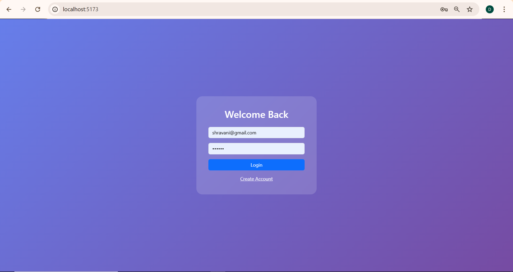
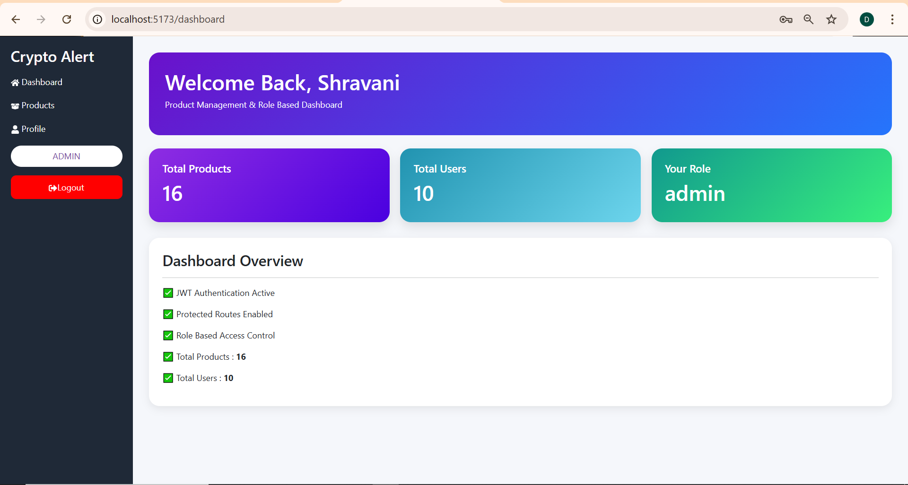
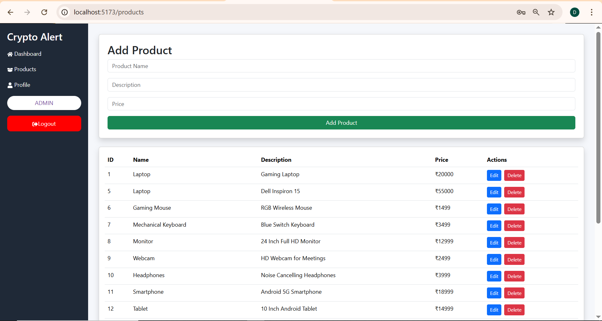
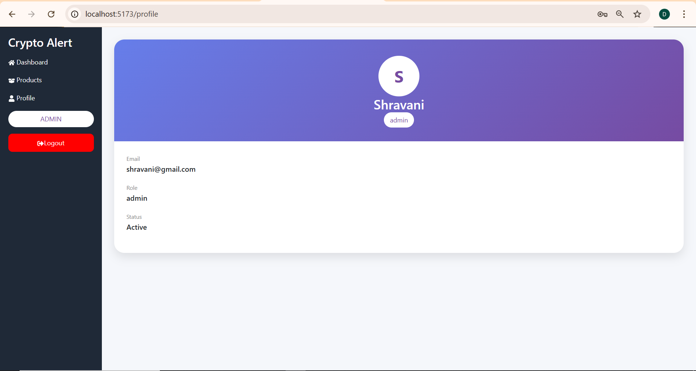

# 🚀 Crypto Alert System


A full-stack web application built using **FastAPI**, **React.js**, **PostgreSQL**, **JWT Authentication**, and **Role-Based Access Control (RBAC)**.

The system provides secure user authentication, role-based authorization, protected API routes, and complete product management functionality for administrators.

---

## 🔗 Quick Links

* **Live Demo:** https://crypto-alert-system-three.vercel.app
* **API Documentation:** https://crypto-alert-backend-zykp.onrender.com/docs
* **GitHub Repository:** https://github.com/shravanibadabe/CryptoAlertSystem

---

## ✨ Features

### 🔐 Authentication & Authorization

* User Registration
* User Login
* JWT Token Authentication
* Password Hashing with Bcrypt
* Protected Routes
* Role-Based Access Control (RBAC)

### 👤 User Features

* Secure Registration
* Secure Login
* User Profile
* Dashboard Access
* View Products

### 👑 Admin Features

* Create Products
* Update Products
* Delete Products
* Manage Product Records
* Access Admin Dashboard
* Role-Based Product Management

### 📊 Dashboard

* Welcome Dashboard
* Product Statistics
* User Role Information
* Activity Overview
* Responsive Sidebar Navigation

---

## 🛠️ Tech Stack

### Frontend

* React.js
* React Router DOM
* Axios
* Bootstrap 5
* CSS3

### Backend

* FastAPI
* SQLAlchemy
* JWT Authentication
* Passlib (Bcrypt)
* Pydantic

### Database

* PostgreSQL (Neon)

---

## 📁 Project Structure

```bash
CryptoAlertSystem
│
├── backend
│   ├── app
│   │   ├── database
│   │   ├── middleware
│   │   ├── models
│   │   ├── routes
│   │   ├── schemas
│   │   ├── utils
│   │   └── main.py
│   │
│   ├── requirements.txt
│   └── .env
│
├── frontend
│   ├── src
│   │   ├── components
│   │   ├── pages
│   │   ├── services
│   │   ├── App.jsx
│   │   └── main.jsx
│   │
│   ├── package.json
│   │
│   └── vite.config.js
│
└── README.md
```

---

## 🗄️ Database Schema

### Users Table

| Column   | Type    | Description     |
| -------- | ------- | --------------- |
| id       | SERIAL  | Primary Key     |
| name     | VARCHAR | User Name       |
| email    | VARCHAR | Unique Email    |
| password | VARCHAR | Hashed Password |
| role     | VARCHAR | user/admin      |

### Products Table

| Column      | Type    | Description         |
| ----------- | ------- | ------------------- |
| id          | SERIAL  | Primary Key         |
| name        | VARCHAR | Product Name        |
| description | VARCHAR | Product Description |
| price       | INTEGER | Product Price       |

---

## 🔑 API Endpoints

### Authentication

| Method | Endpoint              |
| ------ | --------------------- |
| POST   | /api/v1/auth/register |
| POST   | /api/v1/auth/login    |

### Protected Routes

| Method | Endpoint        |
| ------ | --------------- |
| GET    | /api/v1/profile |
| GET    | /api/v1/admin   |

### Products

| Method | Endpoint              |
| ------ | --------------------- |
| GET    | /api/v1/products      |
| GET    | /api/v1/products/{id} |
| POST   | /api/v1/products      |
| PUT    | /api/v1/products/{id} |
| DELETE | /api/v1/products/{id} |

---

## ⚙️ Local Setup

### Clone Repository

```bash
git clone https://github.com/shravanibadabe/CryptoAlertSystem.git

cd CryptoAlertSystem
```

### Backend Setup

```bash
cd backend

python -m venv venv

venv\Scripts\activate

pip install -r requirements.txt
```

Create `.env`

```env
DATABASE_URL=your_database_url
SECRET_KEY=your_secret_key
ALGORITHM=HS256
ACCESS_TOKEN_EXPIRE_MINUTES=60
```

Run Backend

```bash
uvicorn app.main:app --reload
```

Backend URL:

```bash
http://127.0.0.1:8000
```

### Frontend Setup

```bash
cd frontend

npm install

npm run dev
```

Frontend URL:

```bash
http://localhost:5173
```

---

## 🔒 Security Features

* JWT Authentication
* Password Hashing (Bcrypt)
* Protected Routes
* Role-Based Authorization
* Admin Route Protection
* Secure API Access

---

## 🎮 Demo Credentials

Use the following administrator account to test the application.

### 👑 Admin Account

**Email:** `shravani@gmail.com`

**Password:** `123456`

### Admin Permissions

* Access Dashboard
* View Product Statistics
* Create Products
* Update Products
* Delete Products
* Manage Product Records
* Access Protected Routes
* View User Information

> Note: Product management operations are restricted to administrators through Role-Based Access Control (RBAC).

---

## 🌐 Live Demo

### Frontend (Vercel)

🚀 Live Application:

https://crypto-alert-system-three.vercel.app

### Backend API (Render)

🚀 API Documentation:

https://crypto-alert-backend-zykp.onrender.com/docs

### Database

☁️ PostgreSQL hosted on Neon Database

---

## ☁️ Deployment

This project is fully deployed using modern cloud platforms.

### Frontend Deployment – Vercel

**Frontend URL:**

https://crypto-alert-system-three.vercel.app

Features:

* Automatic deployment from GitHub
* Global CDN
* HTTPS Enabled
* Fast Build & Deployment

---

### Backend Deployment – Render

**Backend URL:**

https://crypto-alert-backend-zykp.onrender.com

**Swagger API Docs:**

https://crypto-alert-backend-zykp.onrender.com/docs

Features:

* Automatic deployment from GitHub
* REST API Hosting
* Environment Variable Support
* HTTPS Enabled

---

### Database Deployment – Neon PostgreSQL

Features:

* Managed PostgreSQL Database
* Secure Cloud Storage
* High Availability
* Scalable Infrastructure

---

## 🔗 Project Links

| Service           | URL                                                 |
| ----------------- | --------------------------------------------------- |
| Frontend          | https://crypto-alert-system-three.vercel.app        |
| Backend API       | https://crypto-alert-backend-zykp.onrender.com      |
| API Docs          | https://crypto-alert-backend-zykp.onrender.com/docs |
| GitHub Repository | https://github.com/shravanibadabe/CryptoAlertSystem |

---

## 🚀 Deployment Architecture

```text
User Browser
      │
      ▼
React Frontend (Vercel)
      │
      ▼
FastAPI Backend (Render)
      │
      ▼
PostgreSQL Database (Neon)
```

This architecture provides secure authentication, scalable API hosting, and reliable cloud database storage.

---

## 📸 Screenshots

### Login Page



### Dashboard



### Product Management



### User Profile



---

## 🎯 Future Enhancements

* Product Search
* Product Categories
* Pagination
* Advanced Analytics
* Export Reports
* Dark Mode
* Activity Logs
* User Management Module

---

## 👩‍💻 Author

**Shravani Badabe**

Aspiring Software Developer passionate about:

* Full Stack Development
* Data Analytics
* Artificial Intelligence
* Cloud Technologies

---

## ⭐ Support

If you found this project useful, consider giving it a ⭐ on GitHub.
